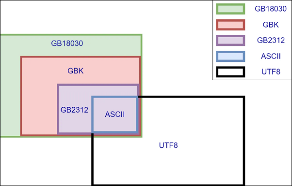
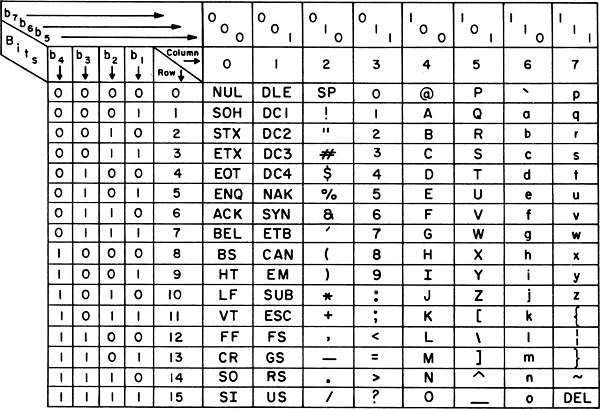
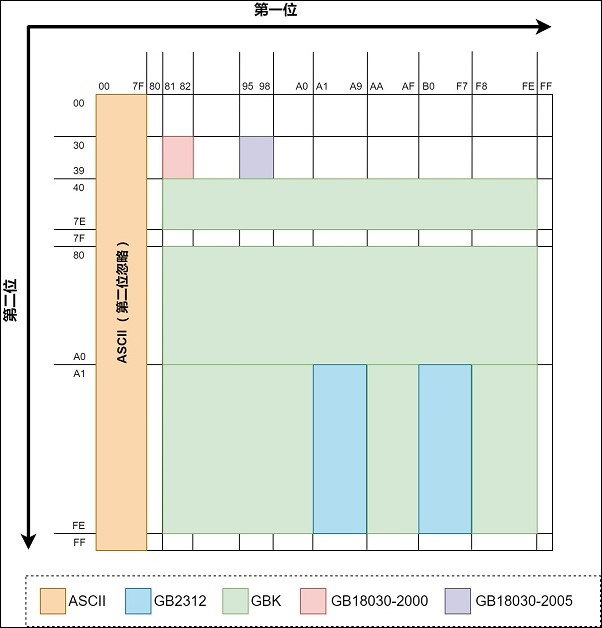

# 字符编码与 C++ 处理

## 基本概念

### 字符集

字符集（Character Set）：是指多个字符的集合。不同的字符集包含的字符个数不一样、包含的字符不一样、对字符的编码方式也不一样。例如 GB2312 是中国国家标准的简体中文字符集，GB2312 收录简化汉字（6763个）及一般符号、序号、数字、拉丁字母、日文假名、希腊字母、俄文字母、汉语拼音符号、汉语注音字母，共 7445 个图形字符。而 ASCII 字符集只包含了128 字符，这个字符集收录的主要字符是英文字母、阿拉伯字母和一些简单的控制字符。

另外，还有其他常用的字符集有 GBK 字符集、GB18030 字符集、Big5 字符集、Unicode 字符集等。

### 字符编码

字符编码（Character Encoding）：字符编码是指一种映射规则，根据这个映射规则可以将某个字符映射成其他形式的数据以便在计算机中存储和传输。例如ASCII字符编码规定使用单字节中低位的7个比特去编码所有的字符，在这个编码规则下字母A的编号是65（ASCII码），用单字节表示就是0x41，因此写入存储设备的时候就是二进制的 01000001。每种字符集都有自己的字符编码规则，常用的字符集编码规则还有 UTF-8/16/32 编码、GB2312/GBK 编码、BIG5编码等。

> 常用字符编码间关系



### 码点

码点（Code Point）：有些地方翻译为码值或内码。是指在某个字符集中，根据某种编码规则将字符编码后得到的值。比如在ASCII字符集中，字母A经过ASCII编码得到的值是65，那么65就是字符A在ASCII字符集中的码点。

> **总结：** 通俗解释字符集就是把字符放到一起的一个集合。而这个集合的每一个字符都对应一个数字，叫做码点。那么，这样就建立起来数字和字符之间的索引关系。那么，某个字符在计算机中怎么表示，具体占用几个字节等等，这些就需要编码规则来解决了。这个就是字符编码，他来解决根据某个规则来将字符映射到相应的码点上面。

## ASCII 编码

ASCII编码一共规定了 128 个字符的编码规则（其中 0-31 是控制字符（如换行、回车、删除等），32-126 是可打印字符（可以通过键盘输入并且能够显示）），这 128 个字符形成的集合就叫做 ASCII 字符集。在 ASCII 编码中，每个字符占用 7 位，在最高位填充一个 0 至 1个字节（8bits）。

ASCII 编码几乎被世界上所有编码所兼容（UTF16 和 UTF32 除外），使用 ASCII 编码基本不用考虑兼容性和编码转换的问题。

> 1968 年版标准 ASCII 编码表



## Unicode 编码

### Unicode 字符集

**Unicode** ，正式名称为 **The Unicode Standard** ， 是一种用于对世界上大多数书写系统中表达的文本进行一致的表示和处理的信息技术标准。Unicode 标准由 Unicode 联盟维护，当前版本（Unicode 15.0）其字符集定义了 149,186 个字符，涵盖 161 种现代和历史文字及符号、3664 个表情符号（包括颜色） ，以及非可视化控制和格式化代码等等。

这些字符被收录为统一字符集（Universal Coded Character Set, UCS），每个字符映射至一个整数码点（code point），码点的范围是 0 至 0x10FFFF，码点又通常记作 U+XXXX，当中 XXXX 为 16 进位数字。例如 `劲` → U+52B2、`峰` → U+5CF0。

为了解决 Unicode 字符集储存问题，Unicode 制定了多种储存码点的方式，这些方式被统一称为  Unicode 转换格式（Uniform Transformation Format, UTF）。现时流行的 UTF 为 UTF-8、UTF-16 和 UTF-32。每种 UTF 会把一个码点储存为一至多个编码单元（code unit）。例如 UTF-8 的编码单元是 8 位的字节、UTF-16 为 16 位、UTF-32 为 32 位。除 UTF-32 外，UTF-8 和 UTF-16 都是可变长度编码。

### UTF-8 编码

UTF-8（8-bit Unicode Transformation Format）是一种针对 Unicode 的可变长度字符编码，它可以用来表示 Unicode 标准中的任何字符。由于其编码中的第一个字节仍与 ASCII 兼容，这使得原来处理 ASCII 字符的软件无须或只须做少部分修改即可继续使用。因此，它逐渐成为电子邮件、网页及其他存储或传送文字的应用中优先采用的编码。互联网工程工作小组（IETF）要求所有互联网协议都必须支持 UTF-8 编码。

> 目前其已经被标准化为 **[rfc 3629](https://www.rfc-editor.org/rfc/rfc3629)**

UTF-8 成为现时互联网上最流行的格式，可能有以下几个原因：

1. 它采用字节为编码单元，不会有字节序（endianness）的问题。
2. 每个 ASCII 字符只需一个字节去储存。
3. 如果程序原来是以字节方式储存字符，理论上不需要特别改动就能处理 UTF-8 的数据。

UTF-8 的编码单元为 8 位（1 字节），每个码点编码成 1 至 4 个字节。其编码方式很简单，按照码点的范围，把码点的二进位分拆成 1 至最多 4 个字节：

|  Unicode 码点范围  | 码点位数 |  字节1  |  字节2  |  字节3  |  字节4  |
| :----------------: | :------: | :------: | :------: | :------: | :------: |
|  U+0000 ~ U+007F  |    7    | 0xxxxxxx |          |          |          |
|  U+0080 ~ U+07FF  |    11    | 110xxxxx | 10xxxxxx |          |          |
|  U+0800 ~ U+FFFF  |    16    | 1110xxxx | 10xxxxxx | 10xxxxxx |          |
| U+10000 ~ U+10FFFF |    21    | 11110xxx | 10xxxxxx | 10xxxxxx | 10xxxxxx |

这个编码方法的好处之一是，码点范围 U+0000 ~ U+007F 编码为一个字节，与 ASCII 编码兼容。这范围的 Unicode 码点也是和 ASCII 字符相同的。因此，一个 ASCII 文本也是一个 UTF-8 文本。

我们举一个例子解析多字节的情况，欧元符号 `€` → U+20AC：

1. U+20AC 在 U+0800 ~ U+FFFF 的范围内，应编码成 3 个字节。
2. U+20AC 的二进位为 10000010101100
3. 3 个字节的情况我们要 16 位的码点，所以在前面补两个 0，成为 0010000010101100
4. 按上表把二进位分成 3 组：0010, 000010, 101100
5. 加上每个字节的前缀：11100010, 10000010, 10101100
6. 用十六进位表示即：0xE2, 0x82, 0xAC

### UTF-16 编码

UTF-16 是一种 Unicode 字符编码方案，它使用16位（也就是2个字节）来表示每个 Unicode 字符。

> UTF-16 目前已经被标准化为 **[rfc 2781](https://www.rfc-editor.org/rfc/rfc2781)**

在将 Unicode 字符转换为 UTF-16 编码时，首先需要考虑字符所属的平面（plane）。Unicode 定义了 17 个平面，其中大部分常用字符被包含在基本多文种平面（BMP）中。BMP 中的字符使用一个 16 位二进制数单元对其进行编码，即简单地将字符的 Unicode 数值放入 16 位空间中即可。

对于 BMP 平面之外的字符，需要使用代理项来进行编码。具体而言，Unicode 采用了一个划分方案，将所有字符按照其 Unicode 码点数分为两部分：前面一半称为高代理区（High Surrogate Area），其 Unicode 码点范围为 U+D800 至 U+DBFF；后面一半称为低代理区（Low Surrogate Area），其 Unicode 码点范围为 U+DC00 至 U+DFFF。利用这两个区间，可以将一个非BMP字符的位表示划分成两个 16 位数量级的部分，每个部分都可以被看作一个代码单元。

因此，UTF-16 编码和 Unicode 字符之间的转换公式可如下描述：

* 对于BMP字符（U+0000 ~ U+FFFF）：UTF-16 编码值 = Unicode 码点。
* 对于非BMP字符（U+10000 ~ U+10FFFF）：UTF-16 编码值 = ((高代理项 - 0xD800) × 0x400 + (低代理项 - 0xDC00) + 0x10000)。

需要注意的是，在进行UTF-16编码和Unicode字符之间的转换时，还要考虑字节序（byte order），即字节在内存中的存储顺序。UTF-16编码采用了大端序（big-endian）和小端序（little-endian）两种不同的字节序方式。

为了区分UTF-16编码的字节序方式，可以使用 UTF-16 使用 BOM（Byte Order Mark，字节顺序标记）来标识数据的字节序。BOM 是一个特殊的标记字符，其 Unicode 值为 U+FEFF。在 UTF-16 编码中，如果第一个代码单元是 U+FEFF，则说明这个 UTF-16 序列采用的是大端序；如果第一个代码单元是 U+FFFE，则说明这个 UTF-16 序列采用的是小端序。如果没有BOM，则根据应用程序预设的默认字节序来解释数据。

### UTF-32

UTF-32 编码方案使用4个字节（32位）来表示每个 Unicode 字符。在 UTF-32 编码中，每个 Unicode 字符都映射到一个 UTF-32 编码值，这个值就是这个字符的 Unicode 码点。

与 UTF-16 类似，其使用 Byte Order Mark (BOM) 标记来指示其字节序方式。UTF-32 的 BOM 是一个 32 位的特殊标记字符，其 Unicode 值为 U+FEFF 。在UTF-32编码中，如果第一个代码单元是U+FEFF，则说明这个UTF-32序列采用的是大端序；如果第一个代码单元是 U+FFFE，则说明这个 UTF-32 序列采用的是小端序。

## 国标码

### GB2312

GB2312 编码是中国国家标准总局于 1980 年发布的第一个汉字编码国家标准，1981 年 5 月 1 日开始实施，标准号是 GB2312-1980。GB2312 编码适用于汉字处理、汉字通信等系统之间的信息交换，通行于中国大陆；新加坡等地也采用此编码。中国大陆几乎所有的中文系统和国际化的软件都支持 GB2312。GB2312 编码共收录汉字 6763 个，其中一级汉字 3755 个，二级汉字 3008 个。同时，GB2312 编码收录了包括拉丁字母、希腊字母、日文平假名及片假名字母、俄语西里尔字母在内的 682 个全角字符。

GB2312 编码对所收录字符进行了“分区”处理，共 94 个区，每区含有 94 个位，共 8836 个码位。这种表示方式也称为区位码。其分区情况如表所示：

| 区号 | 收录情况                            |
| :---: | ----------------------------------- |
| 01-09 | 收录除汉字外的682个字符             |
| 10-15 | 为空白区，没有使用                  |
| 16-55 | 收录3755个一级汉字，按拼音排序      |
| 56-87 | 收录3008个二级汉字，按部首/笔画排序 |
| 88-94 | 为空白区，没有使用                  |

GB2312 规定对收录的每个字符采用两个字节表示，第一个字节对应 94 个区码；第二个字节对应 94 个位码。其中区码表示汉字所在的区（网格），取值范围为 0xA1 至 0xF7 ，位码表示汉字在该区内的位置（行列），取值范围为 0xA1 至 0xFE 。

在实际应用中，通常需要将GB2312编码转换成实际存储的二进制数据。为了进行这种编码转换，需要先将区位码分别减去 0xA0，得到它们相对于0的偏移量（即 0x01 - 0x7E）。然后使用这两个偏移量构造一个双字节整数（16位），其高字节为区码偏移量加上 0x80，低字节为位码偏移量加上 0x80，即：

高字节 = (区码 - 0xA0) + 0x80
低字节 = (位码 - 0xA0) + 0x80

例如，要将GB2312编码表中的“你”字（区位码为BA A3）转换成实际存储码，首先需要将区码 BA 和位码 A3 分别减去 0xA0，得到它们的偏移量即 0x0B 和 0x03。然后使用这两个偏移量构造一个 16 位的整数，其高字节为 0x8C（即0x0B + 0x80），低字节为 0xAB（即0x03 + 0x80）。因此，“你”字在GB2312编码中的实际存储码为0x8CAB。

> 需要注意的是，当区位码为 FFFE 或 FFFF 时，则表示该字符未被收录在 GB2312 编码表中，不能进行转换。

### GBK

GBK 编码是一种在 GB2312-1980 标准基础上扩展而来的针对汉字的字符集编码方式。其共收录了 21886 个中文字符，包括简体字、繁体字以及一些生僻的汉字，同时兼容 ASCII 字符集。与 GB2312 相比，GBK编 码添加了13000多个汉字、符号和其他字符，因此支持更广泛的汉字文字，被广泛用于中国大陆、台湾地区以及一些东南亚国家。

GBK编码的规则如下：

1. 对于ASCII字符（即字母、数字、符号等），使用一个字节表示，其编码与ASCII一致。
2. 对于汉字，采用两个字节表示，第一个字节的范围是 0x81 到 0xFE，第二个字节的范围是 0x40 到 0xFE（不包括 0x7F ），每个字节都是 8 位二进制数。具体地，第一个字节的高位和低位分别取值为 1 和 0 ，中间6位可以取值范围是0x40到0xFE；第二个字节的高位和低位分别取值为 1 和 0 ，中间6位也可以取值范围是 0x40 到 0xFE。
3. GBK 编码除了收录了 GB2312 中的汉字外，还增加了许多生僻的汉字，这些生僻汉字被放在 GBK 扩展区。其码点范围为 0x81到 0xFE（第一个字节）、0x80 到 0xFE （第二个字节）。

> 由于 GB 2312 和 GBK 均采用固定字节序方式进行编码，因而其不需要考虑字节序问题。

### GB 18030

GB 18030 于2005年3月1日实施，是一种在 GBK 编码的基础上扩展而来、覆盖了多种语言的字符集编码方式。其支持汉字、拉丁字母、西里尔字母、希腊字母等多种字符集，同时也兼容ASCII字符集。GB 18030 编码中包含了 GBK 编码收录的全部 21986 个字符，还新增加了 27481 个字符和符号，总计 49467 个。

GB 18030 采用变长编码方式，其编码的规则如下：

* 对于 ASCII 字符（即字母、数字、符号等），使用一个字节表示，其编码与 ASCII 一致。
* 对于汉字和其他双字节字符，采用两个字节表示，其编码与 GB2312 一致。
* 对于4字节字符，采用 Unicode 进行编码，使用 4 个字节表示。

除此之外，GB 18030 编码还支持扩展区，这是指除了上述范围外的编码区域，可以用来收录更多的汉字、符号和其他字符。具体而言，GB 18030 的扩展区分为两部分：GB 18030-A 和 GB 18030-B。其中，GB 18030-A 收录了23940个生僻汉字，并且使用与 UTF-16BE 相同的方式进行编码；GB 18030-B 则收录了 19502 个Unicode 未收录的汉字和 20833 个符号，采用类似于 GB2312 的方式进行编码。

由于GBK编码是GB2312的扩展，而GB18030又是在GBK基础上扩展，因此 GB 18030 编码具有良好的向下兼容性，可以兼容 GB2312 、GBK 编码以及 ASCII 编码。

## 其他编码

### BIG5

Big5，又称为大五码或五大码，是使用繁体中文（正体中文）社区中最常用的电脑汉字字符集标准，共收录13,060 个汉字。

Big5 编码使用双八位码存储方法，以两个字节来安放一个字符。第一个字节称为高位字节，第二个字节称为低位字节。高位字节使用了 0x81-0xFE，低位字节使用 0x40-0x7E ，及 0xA1-0xFE，其分区描述如下所示：

| 码点范围      | 编码描述                                                                         |
| ------------- | -------------------------------------------------------------------------------- |
| 0x8140-0xA0FE | 保留给用户自定义字符（造字区）                                                   |
| 0xA140-0xA3BF | 标点符号、希腊字母及特殊符号<br />（包括在 0xA259-0xA261 安放了九个计量用汉字） |
| 0xA3C0-0xA3FE | 保留，此区没有开放作造字区用                                                     |
| 0xA440-0xC67E | 常用汉字，先按笔划再按部首排序                                                   |
| 0xC6A1-0xC8FE | 保留给用户自定义字符（造字区）                                                   |
| 0xC940-0xF9D5 | 次常用汉字，亦是先按笔划再按部首排序                                             |
| 0xF9D6-0xFEFE | 保留给用户自定义字符（造字区）                                                   |

> Big5 虽普及于台湾、香港与澳门等繁体中文通行区，但长期以来仅仅作为业界标准，未被进一步标准化。虽然倚天中文系统、Windows 等主要系统的字符集都是以 Big5 为基准，但厂商又各自增加不同的造字与造字区，派生出诸多版本。2003年，Big5-2003 被收录到 CNS11643 中文标准交换码的附录当中，才算是取得了较正式的地位。

## 各编码前两位描述



## C++ 编码支持（C++ 11）

### 字符类型支持

```c++
char        	// 基本字符类型
wchar_t		// (C++98) 宽字符类型（长度由编译器定义）

char16_t 	// (C++11) 用于存储 UTF-16 编码的 Unicode 字符
char32_t 	// (C++11) 用于存储 UTF-32 编码的 Unicode 字符
```

### 字符串类型支持

```c++
typedef basic_string<char> string;
typedef basic_string<wchar_t> wstring;
typedef basic_string<char16_t> u16string;
typedef basic_string<char32_t> u32string;
```

### 字符串前缀定义

> 可以采用 `u8/u/U` 前缀分别定义 `UTF-8/16/32` 字符串
> 对于 Unicode 字符描述，可采用 `\u + XXXX` 或 `\U + XXXXXXXX`

```c++
char16_t c = u'\u4f60';
char32_t C = U'\U00004f60';
```

### Unicode 库函数支持

```c++
// 多字节字符转换为 UTF-16 编码
size_t mbrtoc16 ( char16_t * pc16, const char * pmb, size_t max, mbstate_t * ps);

// UTF-16 字符转换为多字节字符
size_t c16rtomb ( char * pmb, char16_t c16, mbstate_t * ps );

// 多字节字符转换为 UTF-32 编码
size_t mbrtoc32 ( char32_t * pc32, const char * pmb, size_t max, mbstate_t * ps);

// UTF-32 字符转换为多字节字符
size_t c32rtomb ( char * pmb, char32_t c32, mbstate_t * ps );

// class template
codecvt<char,char,mbstate_t>	 // performs no conversion
codecvt<wchar_t,char,mbstate_t>	 // converts between native wide and narrow character sets
codecvt<char16_t,char,mbstate_t> // converts between UTF16 and UTF8 encodings, since C++11
codecvt<char32_t,char,mbstate_t> // converts between UTF32 and UTF8 encodings,since C++11
```

### Others

> g++ 字符串编译选项 ` g++ -finput-charset=utf-8 ....`

## 参考资料

> [程序员必备：彻底弄懂常见的7种中文字符编码](https://zhuanlan.zhihu.com/p/46216008)

> [字符集和字符编码 (Charset &amp; Encoding)](https://www.runoob.com/w3cnote/charset-encoding.html)

> [从零开始的 JSON 库教程（四）：Unicode](https://github.com/miloyip/json-tutorial/blob/master/tutorial05/tutorial05.md)

> [GB2312 编码规则与代码实现](https://blog.csdn.net/apollon_krj/article/details/77131045)

> [C++11 Unicode 支持](https://blog.csdn.net/K346K346/article/details/82016543)

> [cppreference](https://en.cppreference.com/w/cpp/string/basic_string)

> [ChatGPT 开源支持](https://chatgpt.qdymys.cn/#/chat/1681701805330)

> [维基百科 wikipedia](https://zh.wikipedia.org/)

&nbsp;
